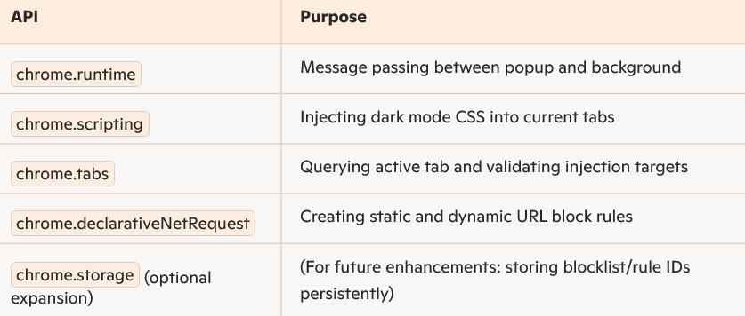

# chrome-extension
 A lightweight Chrome extension to toggle dark mode on any website and block distracting domains.  Built using Manifest V3, with dynamic rule control and a simple popup UI. 
<h1> Personal Chrome Extension — Dark Mode & Site Blocker 🚀</h1> 
A lightweight and beginner-friendly Chrome Extension that allows users to:
<li>- 🌓 Toggle dark mode on any website</li>
<li>- 🚫 Block distracting domains (e.g. Facebook, YouTube)</li> 
Built from scratch using Manifest V3 and native Chrome Extension APIs, this project taught me how to build a real browser tool that interacts with tabs, scripts, and declarative rules.

<h2><b>💡 What I Learned</b></h2> 
This project started with curiosity and ended with confidence. Here’s what I explored and implemented:
 
 - Setting up a valid manifest.json using Manifest V3
 - Communicating between popup UI and service workers using chrome.runtime.sendMessage
 - Using chrome.scripting.executeScript to inject custom styling into active tabs
 - Blocking specific URLs with chrome.declarativeNetRequest (static and dynamic rules)
 - Handling edge cases: restricted chrome:// URLs, serialization errors, and background script persistence
 - Designing a clean popup with HTML/CSS/JS 

<h2>🧩 Chrome APIs Use</h2>

<h1> How to Use</h1>
 - Clone or download the repo
 - Visit chrome://extensions/ in Chrome
 - Enable Developer Mode
 - Click Load Unpacked and select the extension folder
 - Open any website → Click the extension icon → Toggle dark mode or block domains

